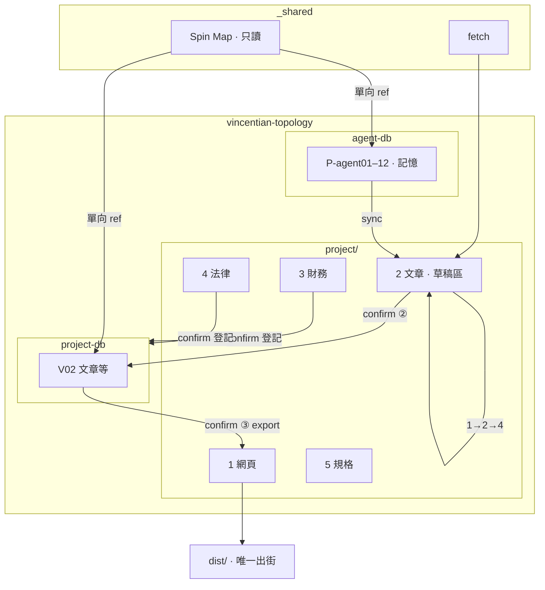

# Vincentian Topology · 專案藍圖 v2.0

> **版本**：Blueprint v2.0 · 2026-06-27  
> **取代**：[archive/BLUEPRINT_v1.0.md](./archive/BLUEPRINT_v1.0.md)（含 Project DB 之舊五區）  
> **下位文件**：`design/IA.md`、`design/BRAND.md`、[PROJECT_DB_V1.0.md](./PROJECT_DB_V1.0.md)、[AGENT_DB_V2.0.md](./AGENT_DB_V2.0.md)、[EGRESS_V1.0.md](./EGRESS_V1.0.md)  
> **改動權**：僅專案擁有者

---

## 1. 專案願景

**Vincentian Topology（萬脈同構｜文森思維）** 以公開閱讀網站為面向，在 `~/Documents/Dev` 內與 **project DB**、**agent-db**、**Spin Map**（經 `_shared`）組成獨立專案宇宙。

**核心原則：**

- 單向閱讀站：無 email、無留言、無站內 Premium 牆
- **唯一對外出口**：公開網頁 server **僅** `dist/`（見 [EGRESS_V1.0.md](./EGRESS_V1.0.md)）
- **三庫分工**：Spin Map 只讀 · agent-db = P-agent 記憶 · **project DB** = 持久資產（文章、外參、財務…）
- Spin Map **零寫入**；引用用 **單向** `gravity_links` / `spin_map_uuid`
- 文章：**草稿區 1→2→4** → **confirm ② project DB** → **confirm ③ export**

**平台底線（跨 project）**：[`~/Documents/Dev/_shared/governance/PLATFORM_MINIMUM.md`](../../../_shared/governance/PLATFORM_MINIMUM.md)

---

## 2. `~/Documents/Dev` 分布

```
~/Documents/Dev/
├── _shared/
│   ├── governance/           PLATFORM_MINIMUM.md
│   ├── fetch/                搜索 Agent 下載工作區
│   └── spin-map →            Spin Map Database（只讀）
│
└── vincentian-topology/
    ├── project/              本 repo（五區 1–4 + 規格）
    ├── project-db/           本專案持久資產庫（project.csv · V01–V12）
    └── ai-agent/
        └── agent-db/         P-agent 記憶（agent_Brain.csv）
```

### 2.1 關係總圖



---

## 3. 五區（`project/`）

| 區 | 路徑 | 職責 | deploy |
|----|------|------|--------|
| **1 網頁** | `src/`、`public/` | Astro；上站稿 `src/content/` | **僅** `dist/` |
| **2 文章** | `articles/drafts/` … | 草稿區；Agent 流水工作 | 否 |
| **3 財務** | `finance/` | 日常營運；`private/` | 否 |
| **4 法律** | `legal/` | 法務工作稿 | 否 |
| **5 規格** | `constitution/`、`design/`、`AGENTS.md` | 憲法、IA、**外來 Agent 分流** | 否 |

`design/` 唔直接 deploy；見 `design/DEPLOY.md`。

---

## 4. 三庫概要

| 庫 | 路徑 | 樞 | 用途 |
|----|------|-----|------|
| **Spin Map** | `_shared/spin-map` | `Brain.csv` | 共享知識 · **只讀** |
| **agent-db** | `ai-agent/agent-db/` | `agent_Brain.csv` | **P-agent01–12** 記憶／會議 |
| **project DB** | `project-db/` | `project.csv` | confirm ② 後資產（**V02** 文章等） |

詳見 [PROJECT_DB_V1.0.md](./PROJECT_DB_V1.0.md) · [AGENT_DB_V2.0.md](./AGENT_DB_V2.0.md) · [DATABASE_REDESIGN.md](./DATABASE_REDESIGN.md)。

- **未 confirm ②** → 禁止文章入 **project DB V02**
- agent-db **禁止** deploy／export

---

## 5. 文章流水（v1.1）

| 步 | 動作 |
|----|------|
| 1 | Agent 1：P-agent 正本 → sync `drafts/` |
| 2 | **👤 ①** 定稿 |
| 3 | Agent 2：edit 規則 · 修改紀錄 |
| 4 | Agent 4：compliance 規則 |
| 4b | fail → 列原因 → **Agent 1** |
| 5 | **👤 ②** 指令 AI 入 **project DB** · 刪 drafts |
| 6 | **👤 ③** 獨立 export／deploy |

**Agent 3 不參與**文章流水。

---

## 6. 跨庫邊界

| 通道 | 方向 | 允許 | 禁止 |
|------|------|------|------|
| Spin Map → project／agent | 單向 ref | `spin_map_uuid` · outbound 引力 | 回寫 Spin Map · `spin_map_copy` |
| project DB → `src/content/` | confirm ③ | **V02** `exportable` 文章 | internal 櫃 |
| agent-db → 公開網 | — | — | **任何** export |
| `_shared/fetch` → project | — | 下載至草稿區 | 寫入 Spin Map |

**舊庫** `~/Documents/Vincentian Topology Database/`：**廢止**（Batch 5 標 SUPERSEDED）· 現行 **`project-db/`**。

---

## 7. 公開網站摘要

| 欄目 | URL |
|------|-----|
| 入門閱讀 | `/intro` |
| 文森世界 | `/view` |
| 專題探討 | `/topics` |
| 經典註解 | `/classics` |

禁發清單：`design/IA.md`；Spin Map P 母檔、借題練筆 uuid 不得上站。

---

## 8. 實施階段（~/Documents/Dev 遷移）

| Phase | 內容 | 狀態 |
|-------|------|------|
| **1** | `~/Documents/Dev/` 結構、project 搬遷、`_shared` | ✅ |
| **2** | 憲法、BLUEPRINT v2、README、Cursor rules | ✅ |
| **3** | `ai-agent/agent-db/` 骨架、四 Agent 規格、`AGENTS.md` | ✅ |
| **4** | 草稿區 `{slug}/`、流水 metadata、export 流程 | ✅ |

---

## 9. 文件索引

| 文件 | 說明 |
|------|------|
| 本藍圖 | `constitution/BLUEPRINT_v2.0.md` |
| 專案憲法 | `constitution/CONSTITUTION_V1.0.md` |
| agent-db 憲法 | `constitution/AGENT_DB_V2.0.md` |
| project DB 憲法 | `constitution/PROJECT_DB_V1.0.md` |
| 三庫重設計 | `constitution/DATABASE_REDESIGN.md` |
| 唯一出口 | `constitution/EGRESS_V1.0.md` |
| Export／入庫 | `design/EXPORT.md` |
| 草稿區 | `articles/drafts/`（repo 根 `草稿區/`）· 說明 `articles/DRAFTS.md` |
| 遷移進度 | `../MIGRATION.md`（vincentian-topology 根） |
| 舊 Project DB 憲法 | `constitution/archive/CONSTITUTION_PROJECT_DB_V1.0.md` |

---

*Blueprint v2.0 · 2026-06-28（三庫 · project DB）*
