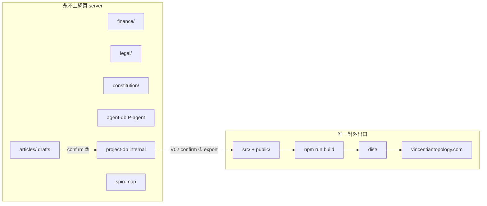

# 唯一對外出口 · 憲法 V1.0（Egress）

> **效力**：Vincentian Topology **專案憲法級**鐵律；與 [BLUEPRINT_v2.0.md](./BLUEPRINT_v2.0.md)、[CONSTITUTION_V1.0.md](./CONSTITUTION_V1.0.md) 同級。  
> **優先於**：`design/` 內一般設計稿、部署習慣、Agent 自作主張之「方便上傳」。  
> **改動權**：僅專案擁有者；修訂須標版本號，舊版移入 `archive/`。  
> **AI 禁止**：未獲用戶明確「確認」修憲前，不得弱化、繞過或省略本條。

**操作檢查表（下位）**：[design/DEPLOY.md](../design/DEPLOY.md)

---

## §1 原則（寫死）

**公開網頁 server（vincentiantopology.com 及同級 hosting）之唯一合法來源，係本 repo 經 Astro 正式 build 產生之 `dist/`。**

- 除網站 build 管線允許之內容外，**任何**其他 folder、資料庫、正本、工作區檔案 **不得**上傳、同步、或設為 web document root。
- 本條定義專案對外之**唯一出口**；每次 deploy、DNS 變更、手動 FTP／面板 upload，均視為「出門」，**必須**執行出門檢查（見 `design/DEPLOY.md`）。

---

## §2 網站範圍（准許進入 build／deploy 鏈）

| 角色 | 路徑 | 說明 |
|------|------|------|
| **Build 輸入** | `src/` | 頁面、元件、**上站稿** `src/content/` |
| **Build 輸入** | `public/` | **刻意公開**之靜態檔（logo、favicon 等） |
| **Build 設定** | `astro.config.mjs`、`package.json` 等 | 參與 build，本身不上傳 |
| **唯一 Deploy 產物** | **`dist/`** | **唯一**應上傳至網頁 server 之目錄 |

**`npm run build` 完成後，只有 `dist/` 內容可對外。** Hosting 須設定 output／publish directory 為 **`dist`**，**禁止**以 repo 根目錄或其他 folder 作為 web root。

---

## §3 禁止出街（永不上傳至公開網頁 server）

下列路徑**永遠不得**成為 deploy 來源、web root、或經 `public/` 間接進入 `dist/`：

| 禁止 | 路徑 |
|------|------|
| 文章工作區 | `articles/`（含 `drafts/`、`drafts-template/`、`craft/`） |
| 財務 | `finance/`（含 `private/`、`templates/`） |
| 法律 | `legal/`（含 `contracts/`、`policies/`、`private/`） |
| 憲法與治理 | `constitution/` |
| 內部設計規格 | `design/`（IA、BRAND 等；**唔**等同讀者看到的頁面） |
| 依賴與產物（錯誤設定時） | `node_modules/`、`.astro/`、原始 `dist/` 以外之誤設根目錄 |
| Agent 資料庫 | `ai-agent/agent-db/`（P-agent · **禁出街**） |
| project DB | `project-db/`（**禁**未 confirm ③ deploy） |
| 全域寫作庫 | `~/Documents/Dev/_shared/spin-map`（Spin Map · 只讀） |
| 草稿與治理 | `~/Documents/Dev/vincentian-topology/project/constitution/` |

**`public/` 鐵律**：只放讀者**理應公開**之檔案。禁止放入帳目、合約、憲法、草稿、內部 PDF、`.env`、私鑰。

---

## §4 出門義務（每次 deploy 前）

專案擁有者與 Agent 在協助 **deploy／上線／出街／推 production** 時**必須**：

1. 確認 hosting 只發布 **`dist/`**（見 `design/DEPLOY.md` §A）  
2. 確認今次內容僅來自已審核之 `src/content/`（`draft: false` 前須人工確認）  
3. 確認 `public/` 無新增不應公開之檔  
4. 確認無 `.env`、財務、法律、憲法路徑誤入 build 產物  
5. **build 後抽查 `dist/`**（或預覽 URL），確認無內部路徑名、敏感檔名外洩  

**未完成出門檢查，不得 deploy。**

Agent 須在用戶要求 deploy 時**主動提醒**檢查表；**禁止**建議將 `articles/`、`finance/`、`legal/`、`constitution/` 上傳至 Vercel／Cloudflare／FTP／主機面板。

---

## §5 與三庫、五區之關係

- **區 2–4**、**agent-db**、Spin Map：**內部**；僅 **project DB V02** 已確認文章经 export 進入 `src/content/`。  
- agent-db **永** export；project DB **internal** 櫃（V01／V03–V05）**永** export。  
- **無**自動同步至網頁 server。

---

## §6 違憲時 AI 必須

1. **停止**擬議之 deploy、上傳、將內部檔移入 `public/`  
2. 向用戶說明衝突條款（引用本檔 §）  
3. 僅在用戶確認修憲或改用合規路徑後繼續  

---

## §7 修訂程序

同 [CONSTITUTION_V1.0.md](./CONSTITUTION_V1.0.md) §12：須專案擁有者授權，回覆含 **「確認」** 二字；舊版移入 `constitution/archive/`。

---

## §8 版本紀錄

| 版本 | 日期 | 摘要 |
|------|------|------|
| **V1.0** | 2026-06-21 | 初版：唯一對外出口 = `dist/`；禁止清單；出門檢查義務 |

---

*唯一對外出口 · 憲法 V1.0 · 2026-06-21*
